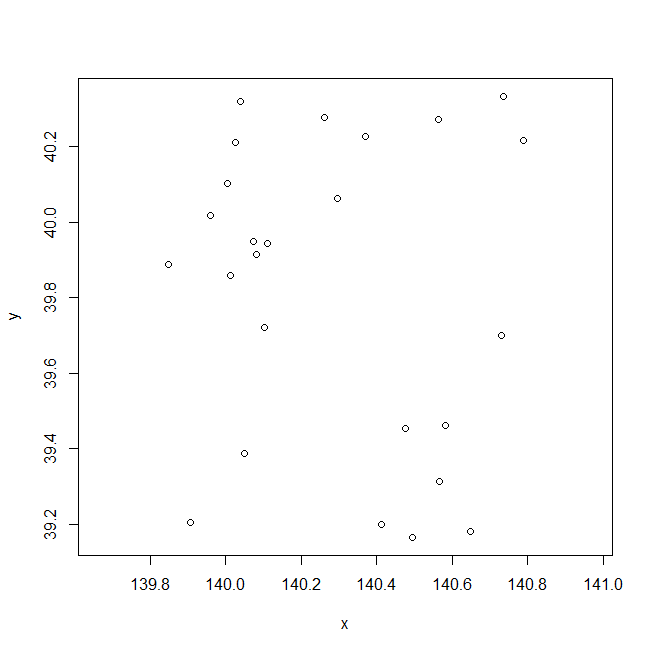
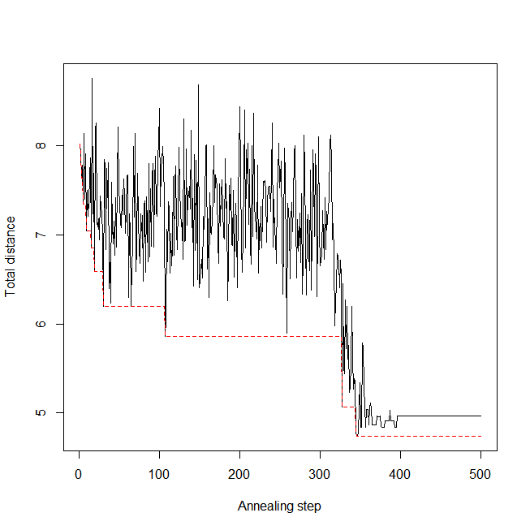
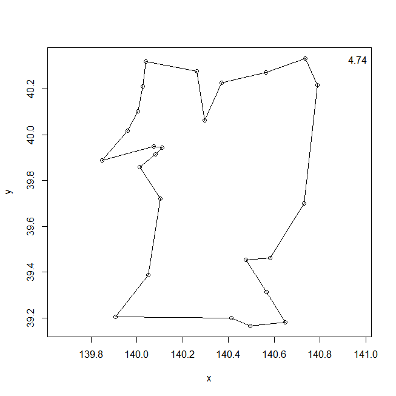

## qatsp packages
Quantum annealing for traveling salesman problem.

### Description
The Traveling Salesman Problem (TSP) is a combination of a set of cities and a distance between each two cities to find the one with the smallest total distance traveled by a tour traveling around all cities just once and returning to the departure place It is an optimization problem.
This problem belongs to the class of NP difficulties in computational complexity theory.

Quantum annealing is a metaheuristic for finding the global minimum of a given objective function over a given set of candidate solutions, by a process using quantum fluctuations.

The qatsp package simulates quantum annealing in the R language and can approximate the traveling salesman problem.
Quantum Monte Carlo method is used for simulation of quantum annealing.

I refer to "[Combinatorial optimization with quantum annealing](http://qiita.com/ab_t/items/8d52096ad0f578aa2224)" implemented with python.


### Installation
You can install from R console.

If `devtools` is not installed on your PC, install `devtools` with Internet connection.

    install.packages("devtools")

Install from GitHub using `devtools`.
    
    library(devtools)
    install_github("ToshihiroIguchi/qatsp")

Load the `qatsp` package and attach it.

    library(qatsp)

Installation may fail if running under proxy environment.
In that case, you may be able to install using the `httr` package.

### Examples
For reproducibility of results, we set random seeds.

    set.seed(123)
    
Designate city coordinates for x and y to solve the traveling salesman problem.
The length of x and y must be the same.
We will explain by way of example about patrolling municipalities in Akita prefecture.



There are 25 points in this latitude and longitude data.
It seems that [it takes 359 days if supercomputer K calculates the shortest route with brute force.](http://itpro.nikkeibp.co.jp/article/COLUMN/20140514/556564/)
The latitude is stored in `Akita [, 1]`. Longitude is stored in `Akita [, 2]`.
Perform quantum annealing with `qatsp` function.

    result <- qatsp(x = Akita[,1], y= Akita[,2])

By default, `trace = TRUE`, and the transition of the shortest distance during calculation is displayed on the graph.
Optionally, by setting `route = TRUE`, the shortest route is displayed every time the shortest route is updated during calculation.
Other parameters of the qatsp function are 
`beta = 50`, `trotter = 10`, `ann_para = 1`, `ann_step = 500`, `mc_step = 5000`, and `reduc = 0.99` by default.

`summary` function can display summary.

    summary(result)

The shortest path, the shortest distance, the parameters used for calculation, and the calculation time are displayed.

The transition of the shortest distance is displayed by the `plot` function.

    plot(result)



The shortest path obtained by the `route` function is displayed.

    route(result)




### References

[Combinatorial optimization with quantum annealing](http://qiita.com/ab_t/items/8d52096ad0f578aa2224)

[Akita Prefecture - Geographical Survey Institute](http://www.gsi.go.jp/KOKUJYOHO/CENTER/kendata/akita_heso.htm)

[Astonishing quantum computers - suddenly commercialized dream machines](http://itpro.nikkeibp.co.jp/article/COLUMN/20140514/556564/)

### License 

```
MIT License

Copyright (c) 2017 Toshihiro Iguchi

Permission is hereby granted, free of charge, to any person obtaining a copy
of this software and associated documentation files (the "Software"), to deal
in the Software without restriction, including without limitation the rights
to use, copy, modify, merge, publish, distribute, sublicense, and/or sell
copies of the Software, and to permit persons to whom the Software is
furnished to do so, subject to the following conditions:

The above copyright notice and this permission notice shall be included in all
copies or substantial portions of the Software.

THE SOFTWARE IS PROVIDED "AS IS", WITHOUT WARRANTY OF ANY KIND, EXPRESS OR
IMPLIED, INCLUDING BUT NOT LIMITED TO THE WARRANTIES OF MERCHANTABILITY,
FITNESS FOR A PARTICULAR PURPOSE AND NONINFRINGEMENT. IN NO EVENT SHALL THE
AUTHORS OR COPYRIGHT HOLDERS BE LIABLE FOR ANY CLAIM, DAMAGES OR OTHER
LIABILITY, WHETHER IN AN ACTION OF CONTRACT, TORT OR OTHERWISE, ARISING FROM,
OUT OF OR IN CONNECTION WITH THE SOFTWARE OR THE USE OR OTHER DEALINGS IN THE
SOFTWARE.
```

### Auther
Toshihiro Iguchi

